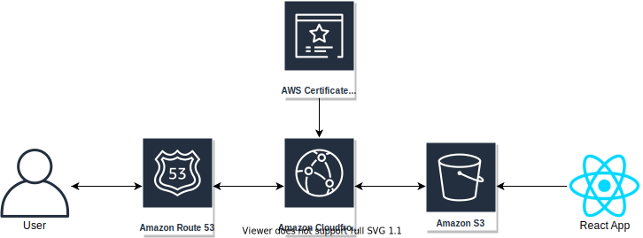
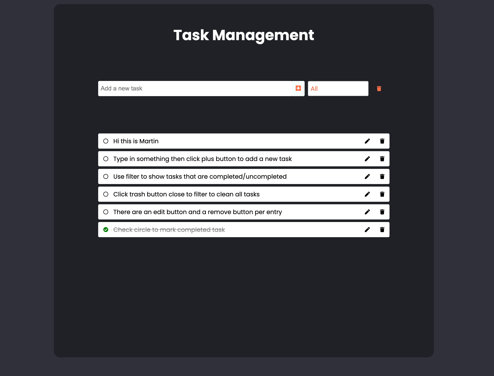

# Terraform Technical Challenge

[Task Management App Demo](https://yin-hsiang-liu.com/)

## Description
The requirements of this challenge is listed below:

### Using [terraform](https://www.terraform.io/) to setup the following infrastructure solution:
- Using CloudFront as CDN, for S3 Bucket which use to serve a SPA. (Single Page App)
- Single Page App can be a demo todo list or anything to your choice. This assignment is more about the infrastructure than the app itself.
- Terraform script should be parameterized for re-usability.
- Bonus point:
  - Setup ACM to handle https with custom domain
  - Setup Route53 to handle custom domain CNAME
  



## Application
The chosen app is a simple to-do list app (task management), building with React, React Context API.


## Requirement
- You will need an AWS account to create this infrastructure.
- A registered domain name.
- AWS CLI version 2 and Terraform CLI installed.
  
## Installation
Installation divided into two parts:

### My App
To run this project, install my-app locally using yarn:

```sh
$ cd ../my-app
$ yarn install
```

To be able to deploy my-app, you will need to modify the `deploy.sh` file. In order to make this file can run, do:
```sh
$ chmod +x deploy.sh
```

### Infrastructure
You need to modify `terraform.tfvars` file, type in the required variables.

After that, in project root directory, run:
```sh
$ cd terraform
$ terraform init
$ terraform plan # -> Run this to preview result
$ terraform apply
```

When Terraform is busy interacting with AWS, you will need to log into AWS console, go to route53, get the name servers from the newly created hosted zone then update Name Servers configuration from your domain name provider.

## License
[MIT](https://choosealicense.com/licenses/mit/)


 


